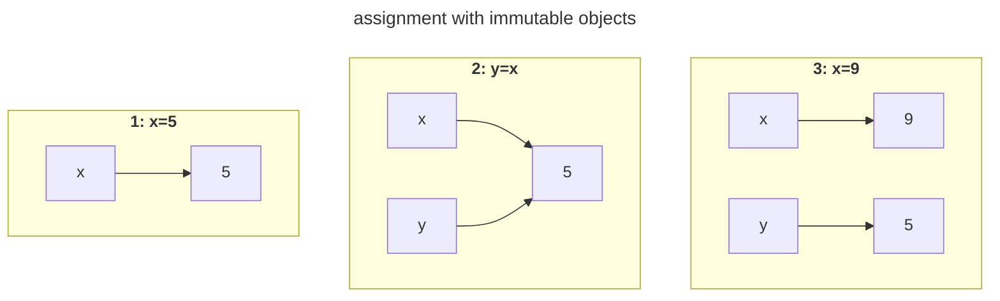
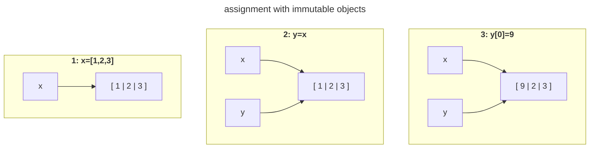

<!-- Author: Daniel Fahnestock -->
<h1> Guide To Python Documentation
<div><i><sup>
or how I learned to stop debugging and love the hint 
</sup></i></div> </h1>

<br>

### Alex What the hell is this?
<dl>
<dt>Short Answer:</dt> 
<dd>This document functions as a combination crash course in python documentation and style guide.
</dd>
<dt>Long Answer:</dt> 
<dd>I was the one who insisted we incorperate these best practices into our project,so it's only 
fair that I write down exactly what you need to know as to not burden everyone else with extra 
homework. In this document i've tried to not only create a unified style but also explain my 
reasoning for why I chose to include these practices </dd>
</dl>

<br>

## 1 ) Typing

Typing in Python is accomplished via optional type hints. Type hints are not enforced at runtime but instead analyzed beforehand with an external type checker (such as MyPy). 

Type hints are especially valuable when collaborating. 


### Basic Syntax


Variables are annotated with the following syntax<br>
<code><i>variable</i> <b>:</b> <i>type</i> <b>=</b> <i>value</i></code> or<br>
<code><i>variable</i> <b>:</b> <i>type</i></code>


Function syntax <br>
<code><b>def</b> <i>function</i><b>(</b> <i>parameter</i><b>:</b><i>type ...</i><b> ) -></b> <i>return_type</i><b>:</b></code>


### Builtins
accessable anywhere without imports

<dl>

`int` `str` `float` `bool`

`None`
	<dd>Represents the absence of a value. It is a common practice to set undefined values to None when dealing with variables that may not be initialized. Optional parameters are typically defaulted to none </dd>

</dl>


### Generic Types

Relax we're not implementing generic types just using them.

<dl>

`tuple[T,…]`
<dd>Where T is the type(s) of the value(s) held in the tuple.  </dd>

`dict[K,V]`
<dd>Where K is the key type and V is the value type. </dd>

`list[T]`
<dd>Where T is the type of the values held in the list </dd>

`typing.Literal[L]`
<dd>Where L is a literal value (Ex:<code>Literal["add"]</code>). </dd>
</dl>


### Unions

Unions are used to annotate identifiers that may be one of multiple types

<code> type | type ... </code>


using unions we can have dictionaries and lists that are heterogeneous\
<code> hetero : list[int|str] = ["a","b",4]</code>

we can annotate an optional value / value that may be undefined like so\
<code>optional: int|None</code>

### Narrowing Types[^narrowing]

[^narrowing]: narrowing types is another concept; the names just overlapped in this context

Doesn't specify any specific type just a common feature. Good to use so we dont loose flexibility

<dl>

`typing.Any`
<dd>Annotation compatible with every type</dd>

`collections.abc.Sequence`
<dd>Objects that are ordered and can be accessed using index notation (<code>name[N]</code>). Examples include: sets, lists, ranges, strings, tuples, etc. Explictly excludes dictionaries.</dd>

`collections.abc.Iterable`
<dd>Objects that can be looped over (<code>for x in object:</code>). Examples include: dictionaries, lists, generators, sets, ranges, etc. </dd>
</dl>

### NamedTuple

A named tuple is a tuple where its contents can be accessed as attributes. Like tuples they are immutable. They are very useful when you need to return completed data from a function. There syntax is as follows.

<pre>
<b>class</b> <i>NamedTupleName</i><b>(NamedTuple):</b>
	<i>field_name</i><b>:</b><i>field_type</i>
		:
</pre>

Fields are accessed using dot notation (Ex:`foo.field`)

NamedTuples are constructed like a regular class where the class name is the name of the constructor. This constructors parameters are each of the fields you defined. You can give the arguments in the order of the fields, but I perfer to use the parameters name as to avoid issues when reordering the fields.


Complete Example:

```py
from typing import NamedTuple,Literal

class file_operation(NamedTuple):
	operator: Literal["r"]|Literal["w"]|Literal["a"] #read write append
	file_name: str
	buffer: bytearray

input_buffer=bytearray()
op=file_operation(operator="r",file_name="log.txt",buffer=input_buffer)
op_2=file_operation("r","log.txt",input_buffer) # this works too
```

<details>
<summary> <h3> Additional Stuff</h3></summary>

You wont need to know these things for this project, but i'm adding this here in case anyone is interested. It helps to know what you're looking for. 

- type - type alias 

- callable - functions are first class in python and can be assigned to variables.

- Protocols - structural subtyping / duck typing 

- typing.TypedDict- dictionary with specific keys

- Generic classes and functions

</details>

<br>
<br>

## 2 ) Docstrings

Docstrings are a way to add annotation metadata to modules, classes, and functions for the purpose 
of documentation.This documentation can be accessed via pythons `help` function, an IDE, or 
additional tools.

One major benifit of using docstrings over plain comments is that most IDEs will display your 
documentation in a tooltip when hovering over autocompleting the function name. 

A docstring is created by text enclosed in triple quotes immediately under a class or function
 definition[^other_ds_locals].

[^other_ds_locals]:[Extra irrelevent info] Docstrings can be used in several other places such as: at the top of 
a file (module), at the top of __inti__.py (package), or after an assigment at the top level 
module (attribute)

```py
class foo():
	"""
	class docstring
	"""
```
```py
def bar():
	"""
	function docstring
	"""
```

Very obvious functions may use one-line docstrings 

```py
def add(a:int,b:int)->int:
	"""Adds two numbers and returns the result"""
```

### reST Format

In order to unify our documentation it's important to establish a format. Thankfully there are many 
widely used formats for python documentation. I have decided to use reST style docstrings due to 
their tursness. [^reST_fields] :

[^reST_fields]: reST does include two other fields ( type` and `rtype`) however we may ommit them as using 
type hints makes them redundant. 


<pre>
<b>"""</b>
<i>Summary</i>

<b>:param </b><i>ParamName</i><b>:</b> <i>ParamDescription</i><b>, defaults to </b><i>DefaultParamVal</i>
...
<b>:raises </b><i>ErrorType</i><b>:</b> <i>ErrorDescription</i>
...
<b>:return:</b> <i>ReturnDescription</i>
<b>"""</b>
</pre>


<br><br>

## 3 ) Deepcopy


In Python assignment only creates a shallow copy. If you want to create a copy of a mutable object make sure you use the deepcopy function (imported from copy).


<details>
<summary><b>EX:</b></summary>
	
```py
frac=fraction(num=1,denom=2)
reciprical=frac      # should be reciprocal=deepcopy(frac)
reciprical.invert()
print(frac,reciprical)

# Expected Output:  1/2 2/1
# Actual Output:   2/1 2/1
```

</details>


**IMPORTANT** This includes function arguments that contain mutable objects- 

<details>
<summary><b>EX:</b></summary>
	
```py
def summation(num_list):
	sum=0
	while num_list:
		sum+=num_list.pop()
	return sum

a=[1,2,3]
print(summation(a),a)

# Expected Output: 6 [1, 2, 3]
# Actual Output: 6 []
```

</details>

**IMPORTANT** - and immutable objects that contain mutable objects.
<details>
<summary><b>EX:</b></summary>
	
```py
def analysis_a(data):
	numbers=data[0]
	numbers.insert(0,0)
	msg=data[1]
	msg="msg "+msg
	...

def analysis_b(data):
	print(data)

data = ([1,2,3],"hi")
analysis_a(data)
analysis_b(data)

# Expected Output: ([1, 2, 3], 'hi')
# Actual Output: ([0, 1, 2, 3], 'hi')
```

</details>

Keep this in mind when working with our returned simulation data.


<details>
	<summary><h4>Optional Explanation</h4> (click to expand)</summary>

There are no primitives in Python; all values are objects. Consequently all variables are references, and 
assignment just changes the addresses stored in those references.
This causes assignments to function the same as other languages when dealing with 
immutable objects.





But appear to differ in functionality when assigning mutable objects



Despite the actual functionality not changing at all.


_Ok but whats up with function arguments?_\
Simple, Python passes function arguments by assigning to them.

</details>


## R ) Resources Used / Further Reading


[reST style docstring format documentation](https://sphinx-rtd-tutorial.readthedocs.io/en/latest/docstrings.html)

[Good blog post on variables and assignment in Python](https://nedbatchelder.com/text/names)

### Python Documentation / Accepted Proposals


[Built In Types Documentation](https://docs.python.org/3/library/stdtypes.html)

[Python Typing Documentation](https://docs.python.org/3/library/typing.html)

[PEP 484 Type Hints](https://peps.python.org/pep-0484)

[collections.abc Documentation](https://docs.python.org/3/library/collections.abc.html)

[PEP 257 Docstring Conventions](https://peps.python.org/pep-0257/)
